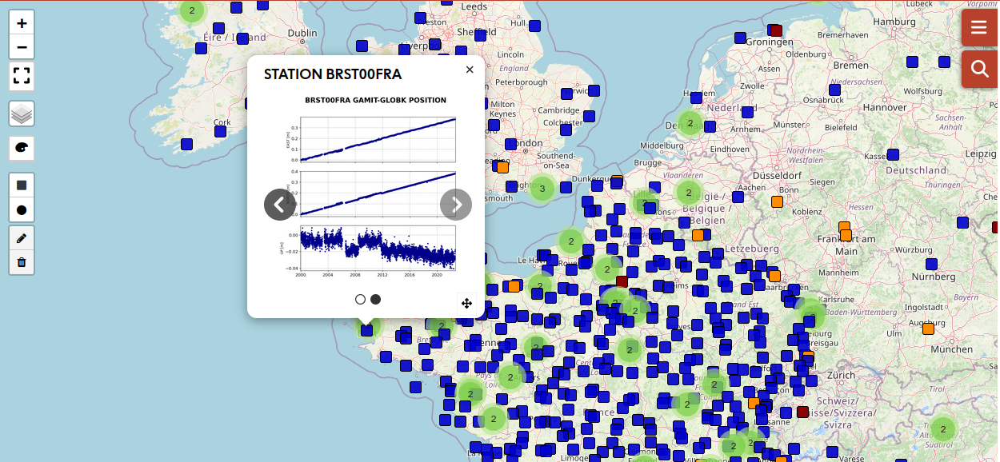

# geodesy-plotter-vjs

[Geodesy-plotter](https://www.poleterresolide.fr/geodesy-plotter) is a vuejs user interface to search and download geodesy products.


## Project setup
```
npm install
```

### Compiles and hot-reloads for development
```
npm run dev
```

### Compiles and minifies for production
```
npm run build
```


### Customize configuration
See [Configuration Reference](https://cli.vuejs.org/config/).
